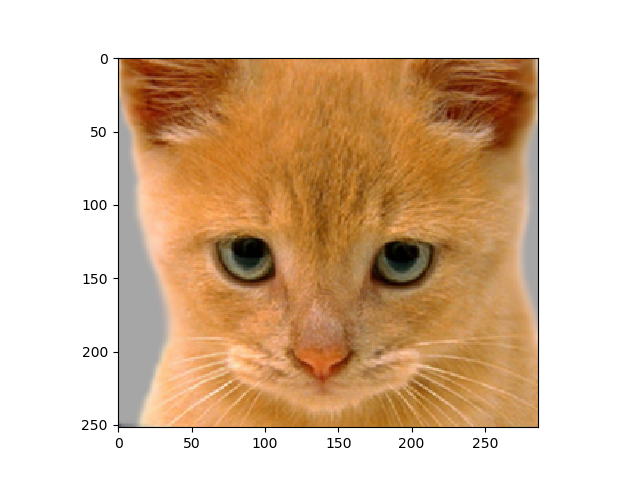

# 蔡昀芸 <span style="color:red">107062548</span>

# Project 1 / Image Filtering and Hybrid Images

## Overview
The project is to write an image filtering function and use it to create a hybrid image.


## Implementation
<b>1. my_imfilter.py</b><br>
<b>code</b>
```
    w1 = image.shape[0]
    h1 = image.shape[1]
    ch1 = image.shape[2]
    w2 = imfilter.shape[0]
    h2 = imfilter.shape[1]
    pad_w1 = int((w2-1)/2)
    pad_h1 = int((h2-1)/2)
    
    #print("pad w1: ",pad_w1)
    #print("pad w2: ",pad_h1)
    
    pading_R=np.pad(image[:,:,0],((pad_h1,pad_h1),(pad_w1,pad_w1)),'constant')
    pading_G=np.pad(image[:,:,1],((pad_h1,pad_h1),(pad_w1,pad_w1)),'constant')
    pading_B=np.pad(image[:,:,2],((pad_h1,pad_h1),(pad_w1,pad_w1)),'constant')
    #print("after padding: ", pading_R.shape)
    output = np.zeros_like(image)
    
    for i in range(0,image.shape[0]):
        for j in range(0,image.shape[1]):
            output[i][j][0] = sum(sum(np.multiply(imfilter,pading_R[i:i+imfilter.shape[0],j:j+imfilter.shape[1]])))
            output[i][j][1] = sum(sum(np.multiply(imfilter,pading_G[i:i+imfilter.shape[0],j:j+imfilter.shape[1]])))
            output[i][j][2] = sum(sum(np.multiply(imfilter,pading_B[i:i+imfilter.shape[0],j:j+imfilter.shape[1]])))
```
<b>Description</b><br>
First, I initialized the weight and height of the image shape.<br>
Second, caculate how much zero padding that i need to add in the image array.<br>
Third, Padding the zero into the image array and get a new padding array with 3 chanels.<br>
Finally, doing the convolution with filter array and new padding array and get a new output filter array.<br>

<b>2. proj1.py</b><br>
<b>code</b>
```
#########################################################################
    # TODO: Use my_imfilter create 'low_frequencies' and                    #
    # 'high_frequencies' and then combine them to create 'hybrid_image'     #
    #########################################################################
    #########################################################################
    # Remove the high frequencies from image1 by blurring it. The amount of #
    # blur that works best will vary with different image pairs             #
    #########################################################################
    low_frequencies =  my_imfilter(image1, gaussian_filter)

    ############################################################################
    # Remove the low frequencies from image2. The easiest way to do this is to #
    # subtract a blurred version of image2 from the original version of image2.#
    # This will give you an image centered at zero with negative values.       #
    ############################################################################
    high_frequencies = image2 - my_imfilter(image2, gaussian_filter)


    ############################################################################
    # Combine the high frequencies and low frequencies                         #
    ############################################################################
    hybrid_image =  high_frequencies + low_frequencies
```
<b>Description</b><br>
First, get the low_frquencies of image1 by using my_imfilter <br>
Second, get the high frequencies of image2 by subtracting the original image2 with the image2 after process filter..<br>
Third, Padding the zero into the image array and get a new padding array with 3 chanels.<br>
Finally, doing the convolution with filter array and new padding array and get a new output filter array.<br>


### Results
 <table border=1>
<tr>
<td>
<span>Test filtering</span>
<td>
<span align='center'> Identity filter <br></span>

</td>
<td>
<span align='center'> Blur<br></span>

</td>
<td>
<span align:'center'>Large Blur<br></span>

</td>
<td>
<span align:'center'> Sobel <br></span>

</td>
<td>
<span align:'center'> Laplacian<br></span>

</td>
<td>
<span align:'center'> High pass<br></span>

</td>
</tr>
 </table>
<table border=1>
<tr>
<th> Image 1</th>
<th> Image 2</th>
<th> Image 1 low freq</th>
<th> Image 2 high freq</th>
<th> Hybrid</th>
<th> Hybrid scales</th>
</tr>
<tr>
<td>

</td>
<td>

</td>
<td>

</td>
<td>

</td>
<td>

</td>
<td>

</td>
</tr>
 <tr>
<td>

</td>
<td>

</td>
<td>

</td>
<td>

</td>
<td>

</td>
<td>

</td>
</tr>
<tr>
<td>

</td>
<td>

</td>
<td>

</td>
<td>

</td>
<td>

</td>
<td>

</td>
</tr>
<tr>
<td>

</td>
<td>

</td>
<td>

</td>
<td>

</td>
<td>

</td>
<td>

</td>
</tr>
<tr>
<td>

</td>
<td>

</td>
<td>

</td>
<td>

</td>
<td>

</td>
<td>

</td>
</tr>
</table>
*Hybrid scales are used to visualize multiple interpretations of the image. It's done by progressively downsampling the hybrid image.
